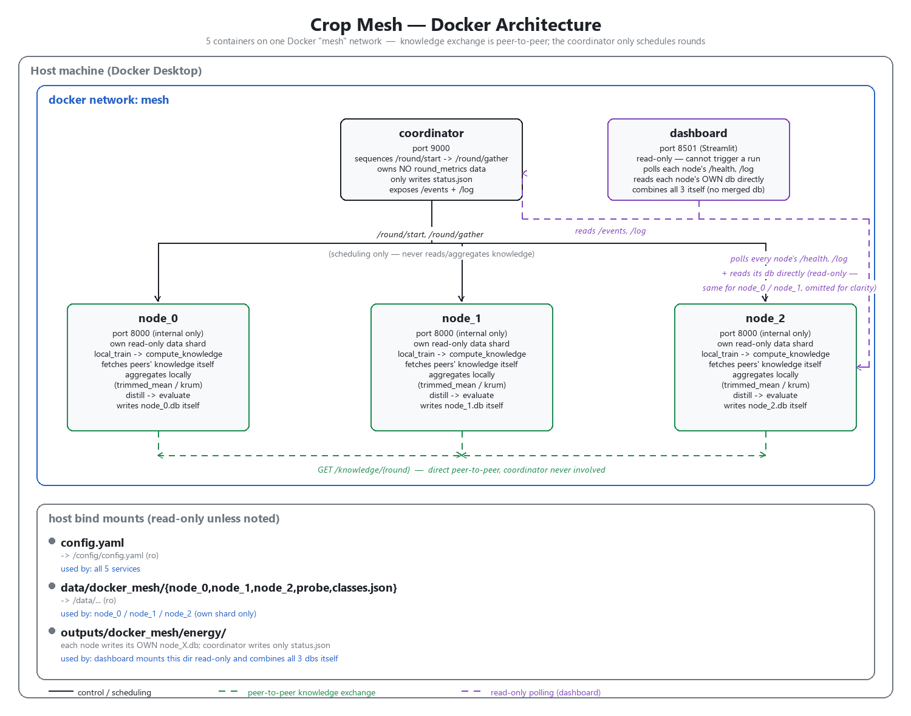

# Docker Mesh — Step-by-Step Guide

Runs the full 3-node federated mesh (coordinator + node_0/1/2 + dashboard)
as Docker containers on one machine, using Docker Compose. All commands
below assume your terminal's working directory is **this `docker/` folder**.

## What gets built

| Service | Dockerfile | Port (host) | Role |
|---|---|---|---|
| `coordinator` | `coordinator/Dockerfile` | `9000` | **Scheduling only**: fans out `/round/start` and `/round/gather` to the 3 nodes so rounds happen in lockstep, exposes `/events` and `/log`. Owns no metrics data — see below |
| `node_0`, `node_1`, `node_2` | `node/Dockerfile` | *(internal only)* | One federated-learning node each, with its own read-only data shard and its own SQLite db |
| `dashboard` | `dashboard/Dockerfile` | `8501` | Streamlit UI that polls the coordinator/nodes and reads the 3 nodes' own DBs directly (read-only, cannot trigger a run) |

All 5 services build from the **repo root** as build context (see `context: ..`
in `docker-compose.yml`), so they're always built from the current source tree.



Regenerate this diagram after an architecture change with
`python scripts/render_docker_architecture.py` (not part of the pipeline —
run manually when needed).

### Why the coordinator isn't a central server

It's tempting to read "coordinator" as a classic client-server parameter
server, but it isn't one here:

- **Knowledge exchange is peer-to-peer.** A node's `/round/gather` fetches
  prototypes/logits directly from the *other nodes'* `GET /knowledge/{round}`
  endpoints — the coordinator never calls `/knowledge` itself and never sees
  the payload.
- **Aggregation happens locally, on each node.** `trimmed_mean`/`krum`
  consensus is computed inside each node process from the peer payloads it
  fetched itself — there's no central model/parameter server.
- **Metrics live only on the node that produced them.** Each node writes its
  own energy/accuracy/communication numbers into its own SQLite db
  (`node_X.db`) as it computes them. The coordinator does **not** keep a copy
  — there is no `merged.db`. The dashboard reads all 3 nodes' dbs directly
  and combines them itself purely for display (`docker/dashboard/data.py`'s
  `merge_round_rows`/`merge_transfer_rows`).
- **All the coordinator actually does** is decide *when* a round starts
  (a timing/liveness role — analogous to a barrier/synchronization signal),
  and expose a small `/events`+`/log` feed of that scheduling activity for
  the dashboard to show. If it goes down mid-run, no node's data is lost —
  it's already on that node's own disk.

---

## Prerequisites

1. **Docker Desktop** (or Docker Engine + Compose plugin) installed and running.
   Verify:
   ```bash
   docker --version
   docker compose version
   ```
2. **Pre-split per-node data** must already exist at the repo root, since the
   containers bind-mount it read-only:
   ```
   data/docker_mesh/
   ├── classes.json
   ├── probe/
   ├── node_0/
   ├── node_1/
   └── node_2/
   ```
   If this folder doesn't exist yet, generate it first (from the repo root,
   with your Python env set up per `docs/execution_guide.md` Step 0/1):
   ```bash
   python scripts/split_node_data.py
   ```
3. **`config.yaml`** at the repo root — the same file used for local (non-Docker)
   training. The `docker_mesh` section controls per-round HTTP timeout, the
   data dir, and the energy DB dir; `training.rounds` controls how many
   rounds the coordinator runs. See "Configuring epochs/rounds" and
   "Restricting the demo to specific crops" below.
4. **`docker/.env`** — sets `HF_CACHE_DIR`, the host path to your local
   Hugging Face Hub cache (e.g. on Windows,
   `C:/Users/<you>/.cache/huggingface/hub`; on Linux/macOS,
   `~/.cache/huggingface/hub`). This is mounted read-only into each node
   container so `timm.create_model(pretrained=True)` (see `models.pretrained`
   in `config.yaml`) uses your already-downloaded backbone weights instead
   of fetching them from huggingface.co at container startup — see
   Troubleshooting below for why that matters. If you've never run local
   (non-Docker) training and this cache doesn't exist yet, either run
   `python -m src.train --config config.yaml` once first to populate it, or
   set `models.pretrained: false` in `config.yaml` instead.

### Configuring epochs/rounds

Both live in `config.yaml`'s `training:` section at the repo root (shared
with the non-Docker pipeline, so a change here affects `python -m src.train`
too):

```yaml
training:
  local_epochs_per_round: 2       # local training epochs before each exchange round
  distill_epochs_per_round: 1     # epochs spent distilling towards consensus knowledge
  rounds: 2                       # number of mesh exchange rounds
```

- `rounds` -> read by `docker/coordinator/main.py` (`CoordinatorRunner.num_rounds`) — how many times the coordinator drives `/round/start` + `/round/gather` before stopping.
- `local_epochs_per_round` / `distill_epochs_per_round` -> read by `docker/node/main.py` (`NodeRunner.local_epochs`/`.distill_epochs`) — how much local training/distillation each node does per round. Note the node's shadow (local-only baseline) arm also reuses `local_epochs_per_round`, *not* `training.baseline_epochs` (that key is only used by the non-Docker scenario harness).

After changing either, re-run `docker compose up -d --build` (or just `docker compose restart coordinator node_0 node_1 node_2` — `config.yaml` is bind-mounted, not baked into the image, so a full rebuild isn't strictly required, but `down && up` guarantees a clean run with the fresh values).

### Restricting the demo to specific crops

For a faster/simpler demo, `config.yaml`'s `docker_mesh:` section can restrict
the mesh to a subset of PlantVillage's 14 crops and drop specific diseases,
without touching `data.root`/`data.manual_node_crops` (which the non-Docker
pipeline still uses unfiltered):

```yaml
docker_mesh:
  included_crops: ["Apple", "Tomato"]      # null/omit to use all 14 crops
  excluded_diseases:
    Apple: ["Black_rot"]
  non_iid_strategy: "by_disease"           # see note below
```

- `included_crops` — only these crops' folders are loaded at all (currently: Apple + Tomato).
- `excluded_diseases` — per-crop list of disease names to drop entirely (currently: Apple's `Black_rot`).
- `non_iid_strategy` — overrides `data.non_iid_strategy` **for the Docker split only**. `data.non_iid_strategy: "manual"` (the repo default) assigns *every* crop to exactly one of the 3 nodes via `data.manual_node_crops`; with only 2 crops left there's no way to keep all 3 nodes non-empty under a whole-crop-per-node split, so the demo instead splits by `(crop, disease)` class round-robin across the 3 nodes.

These are read by `scripts/split_node_data.py` (via `src.data.plantvillage.filter_dataset_by_crop`), which writes the physical per-node folders — **not** by the running containers. Whenever you change any of these three keys, you must regenerate the split before the next `docker compose up`:

```bash
python scripts/split_node_data.py
```

To go back to the full 14-crop mesh, delete/null out all three keys and re-run the command above.

---

## Step 1 — Navigate to the docker folder

```bash
cd docker
```

## Step 2 — Build and start the stack

```bash
docker compose up -d --build
```

- `--build` forces a rebuild so code changes in `src/` are picked up.
- `-d` runs it detached (in the background). Drop `-d` if you want to watch
  all 5 containers' logs interleaved in your terminal instead.
- Compose brings up `node_0`, `node_1`, `node_2` first, then `coordinator`
  (which depends on them), then `dashboard` (which depends on the coordinator
  and all 3 nodes).

**Expected result:** Docker pulls/builds each image (the first build is slow —
`node`'s image installs `torch`/`torchvision`/`timm`, several hundred MB) and
then prints something like:
```
✔ Container docker-node_0-1        Started
✔ Container docker-node_1-1        Started
✔ Container docker-node_2-1        Started
✔ Container docker-coordinator-1   Started
✔ Container docker-dashboard-1     Started
```

## Step 3 — Check that everything is healthy

```bash
docker compose ps
```
All 5 services should show `running`. If any show `Restarting` or `Exited`,
jump to Troubleshooting below.

Check each node came online (each returns `{"node_id": "node_0", "status": "online"}` etc.):
```bash
docker compose exec coordinator python -c "print('coordinator is up')"
docker compose logs coordinator --tail 20
```
You should see `[coordinator] waiting for [...] to come online...` followed
by `[coordinator] all nodes online, starting round loop`.

## Step 4 — Watch it run

- **Live logs (all services):**
  ```bash
  docker compose logs -f
  ```
  (Ctrl+C to stop watching — this does not stop the containers.)
- **Live logs for one service:**
  ```bash
  docker compose logs -f coordinator
  docker compose logs -f node_0
  ```
- **Dashboard UI:** open [http://localhost:8501](http://localhost:8501) in a
  browser. It auto-refreshes every few seconds (`REFRESH_S`, default 3s) and
  shows per-round energy/duration charts, transfer sizes, and each node's
  activity log. It's read-only — it cannot start/stop the run.
- **Coordinator's raw endpoints**, if you want to poll them directly:
  ```bash
  curl http://localhost:9000/events
  curl http://localhost:9000/log
  ```

## Step 5 — Wait for completion

The run finishes after `training.rounds` (from `config.yaml`) rounds complete
across all 3 nodes. The coordinator logs `[coordinator] all rounds complete`
and stays up (idling) afterward — it does not exit or auto-shut-down the stack.
The dashboard will show the run as complete once `outputs/docker_mesh/energy/status.json`
is written.

## Step 6 — Collect results

Results land on the **host**, under the repo root (bind-mounted from the
containers), not just inside the containers:
```
outputs/docker_mesh/energy/
├── node_0.db          # each node's own round history — no merged db exists
├── node_1.db
├── node_2.db
└── status.json        # completion marker, written only by the coordinator
```

## Step 7 — Stop the stack

```bash
docker compose down
```
Stops and removes all 5 containers and the `mesh` network. Bind-mounted data
(`data/docker_mesh/`) and results (`outputs/docker_mesh/energy/`) are **not**
deleted — they live on the host.

To also remove the built images:
```bash
docker compose down --rmi local
```

---

## Re-running from scratch

Every container start wipes its own state on boot (coordinator wipes
`status.json`; each node wipes its own `node_X.db`), so you can just re-run
Step 2 to get a clean run:
```bash
docker compose down
docker compose up -d --build
```

---

## Why `docker compose` and not plain `docker run`

This stack is 5 containers that need a shared network, container-name-based
DNS (`node_0`, `node_1`, `node_2`, `coordinator`), a dozen env vars/bind
mounts each, and a startup order (nodes → coordinator → dashboard).
`docker-compose.yml` already encodes all of that, so `docker compose up`
*is* the equivalent of running the `docker build`/`docker network create`/
`docker run` commands below by hand — just declaratively and in one command.

### Advanced: the equivalent raw `docker build` + `docker run` commands

Only use this if you specifically don't want Compose. Run from the **repo
root** (not `docker/`), since these use `.` as build context to match
`context: ..` in `docker-compose.yml`:

```bash
# 1. One shared network so containers can reach each other by name
docker network create mesh

# 2. Build the 3 images
docker build -t crop-mesh-node -f docker/node/Dockerfile .
docker build -t crop-mesh-coordinator -f docker/coordinator/Dockerfile .
docker build -t crop-mesh-dashboard -f docker/dashboard/Dockerfile .

# 3. Start the 3 nodes (repeat for node_1, node_2, swapping the index).
#    HF_CACHE_DIR should point at your local Hugging Face Hub cache (see
#    Prerequisites above) -- swap in your own path if not on Windows.
HF_CACHE_DIR="C:/Users/<you>/.cache/huggingface/hub"
docker run -d --name node_0 --network mesh \
  -e NODE_ID=node_0 \
  -e CONFIG_PATH=/config/config.yaml \
  -e DATA_ROOT=/data/node_0 \
  -e PROBE_ROOT=/data/probe \
  -e CLASSES_JSON=/data/classes.json \
  -e ENERGY_DB=/energy/node_0.db \
  -e HF_HUB_OFFLINE=1 \
  -e HF_HUB_CACHE=/hf_cache \
  -v "$(pwd)/config.yaml:/config/config.yaml:ro" \
  -v "$(pwd)/data/docker_mesh/node_0:/data/node_0:ro" \
  -v "$(pwd)/data/docker_mesh/probe:/data/probe:ro" \
  -v "$(pwd)/data/docker_mesh/classes.json:/data/classes.json:ro" \
  -v "$(pwd)/outputs/docker_mesh/energy:/energy" \
  -v "$HF_CACHE_DIR:/hf_cache:ro" \
  crop-mesh-node

# 4. Start the coordinator (depends on all 3 nodes existing first). It only
#    ever writes status.json -- no round_metrics db of its own (see "Why
#    the coordinator isn't a central server" above).
docker run -d --name coordinator --network mesh -p 9000:9000 \
  -e CONFIG_PATH=/config/config.yaml \
  -e STATUS_PATH=/energy/status.json \
  -v "$(pwd)/config.yaml:/config/config.yaml:ro" \
  -v "$(pwd)/outputs/docker_mesh/energy:/energy" \
  crop-mesh-coordinator

# 5. Start the dashboard (depends on the coordinator + nodes). It reads the
#    3 nodes' own dbs directly out of ENERGY_DIR and combines them itself.
docker run -d --name dashboard --network mesh -p 8501:8501 \
  -e NUM_NODES=3 \
  -e COORDINATOR_EVENTS_URL=http://coordinator:9000/events \
  -e ENERGY_DIR=/energy \
  -e REFRESH_S=3 \
  -v "$(pwd)/outputs/docker_mesh/energy:/energy:ro" \
  crop-mesh-dashboard
```

Container **names** must match `node_0`/`node_1`/`node_2`/`coordinator`
exactly — the coordinator and dashboard reach nodes at
`http://{node_id}:8000` by default (`NODE_URL_TEMPLATE`), which only
resolves because Docker's embedded DNS maps container name → IP on the
`mesh` network.

Teardown:
```bash
docker rm -f node_0 node_1 node_2 coordinator dashboard
docker network rm mesh
```

---

## Troubleshooting

| Symptom | Likely cause |
|---|---|
| `docker compose up` fails immediately with a volume/mount error | Run it from **inside `docker/`** (relative `..` paths in `docker-compose.yml` are resolved from the compose file's location), and make sure `data/docker_mesh/` and `config.yaml` exist at the repo root |
| A node container keeps restarting | `docker compose logs node_0` (etc.) — usually a missing/empty `data/docker_mesh/node_X/` folder (re-run `python scripts/split_node_data.py`) or a `config.yaml` parsing error |
| Dashboard/coordinator shows a node "offline" even though `docker ps` showed it running a minute ago | Check `docker ps -a` (not just `docker ps`) — the node container likely **exited** shortly after starting. `build_runner()` in `docker/node/main.py` builds the model (`timm.create_model(pretrained=True)`) *before* the FastAPI server starts listening, so a crash there means `/health` never comes up at all. `docker compose logs node_0` will show the real error (e.g. `SSL: CERTIFICATE_VERIFY_FAILED: self-signed certificate in certificate chain` when a corporate proxy intercepts the container's HTTPS call to huggingface.co) — see the `HF_CACHE_DIR` prerequisite above, which avoids that network call entirely |
| Coordinator logs `waiting for [...] to come online...` forever | One or more nodes crashed on startup (see previous row), or is still installing dependencies on a slow first build — check `docker compose ps` and that node's logs |
| `pip install` step in the build fails/hangs | Network/proxy issue reaching PyPI or the PyTorch CPU wheel index; the Dockerfiles already retry up to 8 times automatically, so a hard failure usually means the host has no network access to `pypi.org` / `download.pytorch.org` |
| Dashboard at `localhost:8501` shows no data | Give it a few seconds after `docker compose up` — it needs the coordinator's `/events` endpoint and the node DBs to exist first |
| Round is very slow / times out | Expected on CPU-only hosts under contention — see the tuning notes on `docker_mesh.round_timeout_s` in `config.yaml`; a timeout here fails that node's round rather than hanging forever |
| Want to change how many rounds run | Edit `training.rounds` in `config.yaml` at the repo root, then `docker compose up -d --build` again (config is bind-mounted read-only, so a rebuild isn't strictly required, but `down && up` gives a clean run) |
